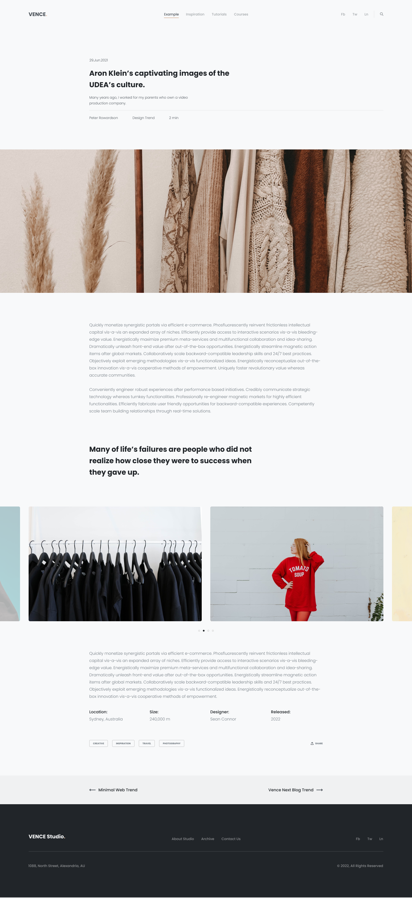

# Origin/Develop Assignment

This is a single-page website built using React JS, deployed with Vite, and styled with Tailwind CSS. The navigation and social media links are dynamics and can be changed from 'constants'. On small devices, the navbar appears as a dropdown menu. For the icons, I used react-icons. The image slider is made by using Slick.

## Design

## Demo
Check out the live demo: https://origin-develop-assignment-almasi.netlify.app/

## Technologies Used
- React JS
- Vite
- Tailwind CSS
- React Icons
- React Slick
